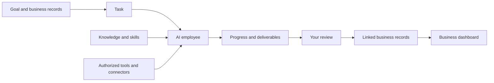

# Teloa · AI-Native Team Studio

**An AI team of your own. For everyone.**

[English](README.md) · [简体中文](README.zh-CN.md)

[Website](https://www.teloa.ai/en/) · [Documentation](https://docs.teloa.ai/en/) · [Resource market](https://market.teloa.ai/en/) · [Issues](https://github.com/teloa-ai/teloa/issues)

Teloa is an **AI-Native Team Studio** for building, managing, and running teams of AI employees. Start with a researcher, content strategist, or developer: define its responsibilities, knowledge, skills, tools, memory, and permissions, then bring roles together to deliver results. These jobs are examples you can configure yourself.

**An AI employee is a lasting work role.** It keeps responsibilities, access boundaries, and role experience with sources. Its identity and configuration remain after a task ends. Discuss plans, follow progress, and request revisions as you would with colleagues.

**You set the goal. Your AI team delivers.** You guide the work, assign responsibilities, define access and approval rules, and review deliverables. Employees carry out work and hand over results within those boundaries. You can also make a direct request without setting up a full team first. **Teloa Community** is the self-hosted personal edition, using **DeepSeek Harness (DSH)** as its agent runtime.

**Community edition:** one human user, multiple AI employees, running on your computer through a Web interface. This repository provides the Community source code under [Apache-2.0](LICENSE). The current source version is **0.2.0-alpha.7**.

## What you can do

| Capability | How it helps |
| --- | --- |
| **Conversations** | Work with text, files and images, use `@` references and `/` commands, and continue in the same context. |
| **Voice input** | The conversation composer includes voice input by default. Prepare the local recognition model on first use, review the transcript in your draft, and send it when ready. You can disable voice input in Settings. |
| **Context inspection** | Bundled dsh-context shows context composition, tokens, estimated cost and compaction records through conversation tabs, the right sidebar or `/context`. Provider billing remains authoritative. |
| **Messaging channels** | Built-in IM Gateway connects Feishu, Lark, Telegram and Slack after you configure and enable each channel in Settings. No separate plugin installation is required. |
| **AI employees and groups** | Define lasting roles with their own knowledge, skills and access. Bring employees together in a group for discussion and collaboration. |
| **Tasks and projects** | Assign a concrete goal, see the responsible employee and execution progress, and organize related work and deliverables around a project. |
| **Businesses and dashboards** | Describe records, fields and views in natural language. Review and save the configuration, manage records, and build dashboards over the business data. |
| **Knowledge and skills** | Provide reference material and reusable working methods. Choose what each employee may use. |
| **Connectors and the market** | Connect supported external tools through MCP. Add employees, skills, connectors, task templates and business dashboards individually or as part of a solution. |
| **Automation** | Schedule repeat work and follow its runs. Enable plans explicitly and keep the runtime online. |
| **Model configuration** | Configure model services supported by the runtime with your own credentials. Employee model settings and permissions remain separate. |


*Product interface with example employees and work. A fresh installation does not require this demo data.*

## How the pieces work together

A **business** organizes records, people and resources. An **AI employee** owns a role; a **skill** supplies a method; **knowledge** provides evidence; a **connector** gives access to a system. A **task** tracks an assignment, a **deliverable** preserves its output, and a **dashboard** summarizes the business records.



For example, in **security operations (SOC)**:

1. Describe an alert-tracking business and review its record fields and pages.
2. Add local records, import a supported table, or configure an authorized data connection.
3. Give an analyst employee relevant procedures, evidence and tools, then assign an alert investigation.
4. Follow the task, inspect the evidence and review the deliverable linked to that alert.
5. Use a dashboard to summarize alert status, severity and trends.

Adding a solution does not automatically connect accounts, authorize employees or start scheduled work. Those choices stay with you.


*Dashboard using synthetic alert records; this is not live security monitoring.*

SOC is the first end-to-end business scenario. Customer delivery, content operations, retail, software development, education, store services and other security workflows are **future scenario examples**, rather than completed integrations. See [industry examples](https://docs.teloa.ai/en/tutorials/industry-examples) and the [SOC walkthrough](https://docs.teloa.ai/en/tutorials/soc-triage).

## Quick start

Bring your own model service and API key. Model usage is billed by your provider; the Community software license does not include inference credits. **0.2.0-alpha.7** is available through [npm](https://www.npmjs.com/package/@teloa/cli) and [Docker Hub](https://hub.docker.com/r/teloa/teloa). Choose native npm installation for local programs, or Docker Hub for container deployment. Source builds remain available below.

### Native npm installation

Use **Node.js 24.x** or **22.x from 22.19 onward**, **npm 11.x from 11.12.1 onward**, and a running local Docker engine for the dedicated PostgreSQL database. Install the exact version into a new command directory; no global installation or source build is required.

```sh
mkdir teloa-command
cd teloa-command
npm install --ignore-scripts @teloa/cli@0.2.0-alpha.7
./node_modules/.bin/teloa up
./node_modules/.bin/teloa doctor
./node_modules/.bin/teloa status
```

Teloa and DSH run natively on your computer. Startup opens the Web interface; configure your model in Settings. The default Web port is 3100. For a new installation, use `./node_modules/.bin/teloa up --port 3101` if it is occupied. See the [installation and stop instructions](https://docs.teloa.ai/en/start/quickstart), and [backup and upgrades](https://docs.teloa.ai/en/deploy/backup) before updating an existing installation.

### Docker Hub with Compose

Install Docker with Compose and start the engine. The published image and the configuration below have been verified on **Linux ARM64**; **amd64 has not been verified**. Teloa, DSH and PostgreSQL run in containers, so host Node.js and pnpm are not required.

Download the versioned configuration into a new directory. It uses `teloa/teloa:0.2.0-alpha.7` for both initialization and the application, with persistent data volumes and a generated database password.

```sh
mkdir teloa-community
cd teloa-community
curl --fail --location https://docs.teloa.ai/downloads/0.2.0-alpha.7/compose.yaml --output compose.yaml
docker compose pull
docker compose up -d --no-build
docker compose ps
docker compose logs --tail=50 app
```

Wait for `db` and `app` to be healthy. Successful exit of the one-time `init` service is expected. Open the complete authentication link from the app log, using the configured local port (3100 by default). If the port is occupied, set `TELOA_PORT=3101` in this directory's `.env` before startup. Keep authentication links private. See [installation and lifecycle instructions](https://docs.teloa.ai/en/start/quickstart) and [backup and upgrades](https://docs.teloa.ai/en/deploy/backup).

Container tools run inside the container; mounting a folder does not give control of your host applications.

### Docker Compose from source

Install Docker with Compose and start the engine. This route runs Teloa and PostgreSQL in containers; host Node.js and pnpm are not required.

```sh
git clone https://github.com/teloa-ai/teloa.git
cd teloa
docker compose up -d --build
docker compose ps
docker compose logs --tail=50 app
```

Wait for `db` and `app` to be healthy. `init` exits after initialization; that is expected. Open the **complete authentication link** printed in the app log. The default address uses `127.0.0.1:3100`. If that port is occupied, put `TELOA_PORT=3101` in a local `.env` before starting and use that port in the authentication link.

Database credentials are generated during initialization. Data persists in named volumes. To pause and resume:

```sh
docker compose stop
docker compose start
```

Container tools run inside the container. Mounting a folder does not give access to applications installed on your host. Use native execution when your work needs local programs.

### Native source installation

Use **Node.js 24.x** or **22.x from 22.19 onward**, **pnpm 11.7.0**, and a running local Docker engine for PostgreSQL. Teloa and DSH run on your computer, while the database runs in Docker.

The current main branch pins DSH **0.2.1-alpha.1** and includes voice input by default. Published npm and Docker releases are updated separately; source features are not necessarily available in an older release.

```sh
git clone https://github.com/teloa-ai/teloa.git
cd teloa
pnpm install --frozen-lockfile
pnpm build
pnpm check:dsh
pnpm setup:database
pnpm setup:dsh
pnpm dev:dsh
```

Open the complete authentication URL printed at startup. On macOS or Linux, use `TELOA_DSH_PORT=3101 pnpm dev:dsh` to choose another Web port. Source-installation state stays under `.runtime/`; the default working directory is `.runtime/teloa/workspace`.

On first use, follow the voice prompt to prepare the local SenseVoice model and allow microphone access. Showing the button does not download models or start recording; cancelling setup preserves your draft. Transcription runs locally, and text you send is handled by your selected model service. If you disable voice input, later starts preserve that choice.

See the [installation guide](https://docs.teloa.ai/en/start/quickstart) and [local development guide](https://docs.teloa.ai/en/develop/local-development) for deployment and troubleshooting. Back up your data before upgrades.

## Your first task

1. Open **Settings → Models**, configure a supported provider, and verify a simple conversation. Model credentials belong in Settings.
2. Create an **AI employee**. Define its responsibility, select reference material, and set its tool and approval boundaries.
3. Open its conversation and make a specific request, such as: “Summarize these files, cite the sources, and list what is still uncertain.”
4. For work that needs tracking, create or approve a task. Follow actual progress, handle requests in **Needs your attention**, and review the deliverable.
5. Organize related work in a business or project, then add a dashboard or schedule as needed.

Guides: [first task](https://docs.teloa.ai/en/start/first-task) · [employees](https://docs.teloa.ai/en/guides/colleagues) · [groups](https://docs.teloa.ai/en/guides/groups) · [businesses and dashboards](https://docs.teloa.ai/en/guides/business) · [market](https://docs.teloa.ai/en/guides/market).

## Architecture and development

| Product layer | Responsibility |
| --- | --- |
| **AI Team** | Employees, collaboration, businesses, projects, tasks and automation. |
| **Agent Studio** | Each employee's responsibilities, knowledge, skills, tools and permissions. |
| **Agent Harness** | Models, execution environments, tools, sandboxing, approvals and runtime events. DSH supplies the current runtime. |

Business services, runtime adaptation and the UI are organized separately:

| Directory | Purpose |
| --- | --- |
| `packages/contract` | Shared types and protocols. |
| `packages/backend` | PostgreSQL-backed business services. |
| `packages/harness-dsh` | DSH integration, task execution and authorization checks. |
| `packages/client/`, `packages/bundle` | Web workspace, shared UI and runtime composition. |
| `packages/cli`, `packages/native-*` | Installation lifecycle and native tool integrations. |
| `packages/mcp-reference`, `packages/im-gateway`, `packages/local-embedding` | Reference access, messaging integration and local retrieval. |
| `config/`, `scripts/` | Pinned dependency baseline, preparation and startup. |
| `tests/`, `examples/industry/` | Regression tests and synthetic business-format examples. |

Before submitting a change:

```sh
pnpm build
pnpm check:client
pnpm check:dsh
NODE_OPTIONS=--max-old-space-size=4096 pnpm typecheck
pnpm test:repo
pnpm test:contract
pnpm test:bindings
```

Run relevant backend or runtime tests for behavior changes. These may require Docker and isolated databases. Keep runtime data and credentials out of commits. See [CONTRIBUTING.md](CONTRIBUTING.md) for the contribution process and DCO requirements.

## Data, permissions and product editions

Application data is stored on the machine running Teloa. Remote models and authorized external tools receive the task context they need. Self-hosting does not make every model call offline. See [SECURITY.md](SECURITY.md) for the permission model and known limitations.

Teloa's three editions share the same product core and serve different working needs. This repository maintains the open-source Community edition.

| Edition | Who it is for and how it is used |
| --- | --- |
| Community | An open-source edition for individuals and developers. Deploy and configure your own workspace with AI employees, collaboration, tasks, automation and skills. |
| Pro | A native Mac application for personal and professional work. Get started with local task execution and access to your files and apps, then create, follow and continue work from your phone. |
| Enterprise | For businesses and organizations, deployed in the company cloud or internal network. Manage members, shared AI employees, permissions and audit, and connect internal data, systems and business workflows. |

All editions use your own model service and API keys; model usage is billed separately. External integrations require compatible services and credentials. Stopping a conversation does not guarantee immediate cancellation of every external request.

## Community and license

- Bugs and proposals: [GitHub Issues](https://github.com/teloa-ai/teloa/issues).
- Contributions: [guide](CONTRIBUTING.md) and [DCO](DCO.md).
- Product support: [support@teloa.ai](mailto:support@teloa.ai).
- Business inquiries: [hi@teloa.ai](mailto:hi@teloa.ai).
- Serious security issues: [security@teloa.ai](mailto:security@teloa.ai), following [SECURITY.md](SECURITY.md). General reports can use Issues; keep sensitive details private.

Teloa Community is licensed under **[Apache-2.0](LICENSE)**. Third-party components retain their own licenses; see [NOTICE](NOTICE) and [THIRD_PARTY_NOTICES.md](THIRD_PARTY_NOTICES.md). The name and branding are covered by the [trademark policy](TRADEMARK.md).
