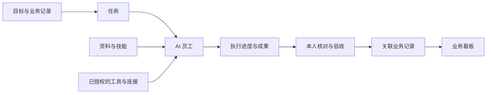

# Teloa · AI-Native Team Studio

**让每个人，都拥有自己的 AI 团队。**

[English](README.md) · [简体中文](README.zh-CN.md)

[官网](https://www.teloa.ai/) · [使用文档](https://docs.teloa.ai/) · [资源市场](https://market.teloa.ai/) · [问题反馈](https://github.com/teloa-ai/teloa/issues)

Teloa 是用于组建、管理和运行 AI 员工团队的 **AI-Native Team Studio**。你可以从一位研究员、内容策划或开发工程师开始，为它明确职责，提供知识、技能、工具、记忆与权限，让不同岗位协作交付成果。这些岗位是使用示例，可自行配置。

**AI 员工是长期工作角色。** 它有职责与授权，保留有来源的岗位经验；一次任务结束后，身份与配置仍可用于后续工作。你可以像与同事合作一样讨论方案、跟进进展和提出修改。

**你提出目标，AI 团队交付成果。** 你负责方向、职责分配、访问范围、审批规则和成果验收；员工在这些边界内执行并交接工作。你仍可以直接提出任务，无需先配齐整支团队。**Teloa 社区版** 是面向个人、自行部署的版本，使用 **DeepSeek Harness（DSH）**作为智能体运行引擎。

**社区版面向个人使用：** 一个用户在自己的电脑上，通过 Web 界面管理多位 AI 员工。本仓库提供 [Apache-2.0](LICENSE) 许可的社区版源码，当前源码版本为 **0.2.0-alpha.7**。

## 可以做什么

| 能力 | 使用方式 |
| --- | --- |
| **对话** | 使用文字、文件、图片、`@` 引用和 `/` 命令，在同一上下文中继续工作。 |
| **语音输入** | 会话输入区默认提供语音入口；首次使用按需准备本地识别模型，转写进入草稿，由你确认后发送。可在设置中停用。 |
| **上下文观察** | 默认随附 dsh-context；在会话页签、右栏或 `/context` 中查看上下文组成、Token、费用估算与压缩记录。费用以模型服务商账单为准。 |
| **消息通道** | IM Gateway 内置并默认加载；在设置中配置并启用飞书、Lark、Telegram 或 Slack，无需另装插件。 |
| **AI 员工与群协作** | 为员工保留长期职责、知识、技能和授权；把多位员工加入工作群，讨论问题、协作完成工作。 |
| **任务与项目** | 交办明确目标，查看负责人和实际执行进度；用项目归集相关工作与成果。 |
| **业务与看板** | 用自然语言描述记录、字段和页面，核对后保存配置；管理业务记录，并基于这些数据搭建看板。 |
| **资料与技能** | 提供判断所需的依据资料和可复用的工作方法，为每位员工选择可使用的内容。 |
| **连接器与市场** | 通过 MCP 接入支持的外部工具；单独添加员工、技能、连接器、任务模板、业务看板，也可以组合成方案。 |
| **自动化** | 为重复工作设置计划并查看运行记录；需要单独启用计划，并保持运行环境在线。 |
| **模型配置** | 使用自己的凭据配置运行引擎支持的模型服务；员工的模型设置与业务权限分别管理。 |


*真实产品界面，使用示例员工与工作数据。首次安装不需要导入这套演示数据。*

## 这些能力怎样配合

**业务**组织记录、员工与资源；**AI 员工**承担职责；**技能**提供方法；**资料**提供依据；**连接器**接入系统。**任务**记录一次交办，**成果**保留交付内容，**看板**汇总业务记录与状态。



以**安全运营（SOC）**为例：

1. 描述要跟进的告警业务，核对记录字段和页面。
2. 添加本地记录、导入支持的表格，或配置有权限使用的数据连接。
3. 为研判员工提供流程、证据和工具，把具体告警交办为调查任务。
4. 查看任务进度、核对证据，验收关联到该告警的成果。
5. 用看板汇总告警状态、严重度和趋势。

添加方案不会自动连接账号、授权员工或启动定时工作。这些配置由你决定。


*看板使用虚构告警记录，不是实时安全监测数据。*

SOC 是首个完整业务流程场景。客户交付、内容运营、电商零售、软件研发、教育培训、门店服务和其他安全方向是**后续场景示例**，不代表这些集成已经完成。见[行业场景与业务组合](https://docs.teloa.ai/tutorials/industry-examples)和 [SOC 使用教程](https://docs.teloa.ai/tutorials/soc-triage)。

## 快速开始

需要自备模型服务与 API 密钥，模型调用费用由对应服务商收取；社区版软件许可不包含推理额度。**0.2.0-alpha.7** 已提供 [npm](https://www.npmjs.com/package/@teloa/cli) 与 [Docker Hub](https://hub.docker.com/r/teloa/teloa) 安装渠道。需要使用本机程序时优先选择 npm 原生安装；需要容器部署时选择 Docker Hub。下方仍保留源码构建方式。

### npm 原生安装

需要 **Node.js 24.x** 或 **22.19 及以上的 22.x**、**npm 11.12.1 及以上的 11.x**，以及运行中的本机 Docker 引擎，用于独立 PostgreSQL 数据库。将精确版本安装到新建命令目录，无需全局安装或编译源码。

```sh
mkdir teloa-command
cd teloa-command
npm install --ignore-scripts @teloa/cli@0.2.0-alpha.7
./node_modules/.bin/teloa up
./node_modules/.bin/teloa doctor
./node_modules/.bin/teloa status
```

Teloa 与 DSH 在电脑上原生运行。启动后打开 Web 界面，在设置中配置模型；默认 Web 端口为 3100。新安装端口被占用时，使用 `./node_modules/.bin/teloa up --port 3101`。启停操作见[安装指南](https://docs.teloa.ai/start/quickstart)，已有安装更新前先看[备份与升级](https://docs.teloa.ai/deploy/backup)。

### Docker Hub + Compose

先安装带 Compose 的 Docker，并启动 Docker 引擎。正式镜像及以下配置已验 **Linux ARM64**；**amd64 尚未验证**。Teloa、DSH 与 PostgreSQL 均在容器内运行，本机不需要安装 Node.js 或 pnpm。

将本版本配置下载到新目录。初始化与应用均使用 `teloa/teloa:0.2.0-alpha.7`，沿用持久数据卷与自动生成的数据库口令。

```sh
mkdir teloa-community
cd teloa-community
curl --fail --location https://docs.teloa.ai/downloads/0.2.0-alpha.7/compose.yaml --output compose.yaml
docker compose pull
docker compose up -d --no-build
docker compose ps
docker compose logs --tail=50 app
```

等待 `db` 与 `app` 显示健康；一次性 `init` 服务成功退出属于正常行为。使用应用日志中的完整认证链接进入，采用所配置的本机端口（默认 3100）。端口被占用时，先在该目录 `.env` 中填写 `TELOA_PORT=3101`。不要公开认证链接。启停操作见[安装指南](https://docs.teloa.ai/start/quickstart)，更新前先看[备份与升级](https://docs.teloa.ai/deploy/backup)。

容器中的工具执行容器内的程序，挂载文件夹不会获得本机应用的操作权限。

### Docker Compose 源码构建

先安装带 Compose 的 Docker，并启动 Docker 引擎。此方式将 Teloa 与 PostgreSQL 一起运行在容器中，本机不需要安装 Node.js 或 pnpm。

```sh
git clone https://github.com/teloa-ai/teloa.git
cd teloa
docker compose up -d --build
docker compose ps
docker compose logs --tail=50 app
```

等待 `db` 和 `app` 显示健康。`init` 是一次性初始化服务，成功退出属于正常行为。使用应用日志中的**完整认证链接**进入，默认地址使用 `127.0.0.1:3100`。端口已被占用时，先在本地 `.env` 中填写 `TELOA_PORT=3101`，启动后将认证链接的端口改为该端口。

初始化时自动生成数据库凭据，数据保存在持久卷中。暂停与继续同一安装：

```sh
docker compose stop
docker compose start
```

容器中的工具调用容器内的程序，挂载文件夹不会获得本机应用的操作权限。需要使用电脑上的程序时，选择本机源码运行。

### 本机源码运行

需要 **Node.js 24.x** 或 **22.19 及以上的 22.x**、**pnpm 11.7.0**，以及用于 PostgreSQL 的本机 Docker 引擎。此方式在电脑上运行 Teloa 与 DSH，数据库运行在 Docker 中。

当前主分支固定 DSH **0.2.1-alpha.1**，包含默认语音输入；已发布的 npm 和 Docker 版本独立更新，请勿将源码能力视为旧发行包已包含的功能。

```sh
git clone https://github.com/teloa-ai/teloa.git
cd teloa
pnpm install --frozen-lockfile
pnpm build
pnpm check:dsh
pnpm setup:database
pnpm setup:dsh
pnpm dev:dsh
```

使用终端输出的完整认证地址进入。macOS 或 Linux 下可用 `TELOA_DSH_PORT=3101 pnpm dev:dsh` 指定其他 Web 端口。源码安装的运行数据保存在 `.runtime/`，默认工作目录是 `.runtime/teloa/workspace`。

首次点击语音入口时，按提示准备本地 SenseVoice 模型并允许麦克风访问。仅显示入口不会下载模型或开始录音；取消准备保留草稿。转写在本机完成，发送后的文本按所选模型服务处理。停用语音后，后续启动保留你的选择。

部署和故障排查见[安装指南](https://docs.teloa.ai/start/quickstart)与[本地开发指南](https://docs.teloa.ai/develop/local-development)。升级前先备份数据。

## 完成第一项工作

1. 进入**设置 → 模型**，配置支持的模型服务，先确认普通对话能得到回应。模型密钥只填写在设置中。
2. 创建一位 **AI 员工**，写清职责，选择可用资料，设置工具与审批边界。
3. 打开员工会话，提出具体要求，例如：「整理这些文件，列明来源，并指出还不能确定的地方。」
4. 需要跟踪的工作创建或批准为任务，查看实际进度，在**需要你**中处理请求，并核对最终成果。
5. 按需要用业务或项目组织相关工作，再添加看板或定时计划。

常用指南：[第一项任务](https://docs.teloa.ai/start/first-task) · [AI 员工](https://docs.teloa.ai/guides/colleagues) · [群协作](https://docs.teloa.ai/guides/groups) · [业务与看板](https://docs.teloa.ai/guides/business) · [市场资源](https://docs.teloa.ai/guides/market)。

## 架构与开发

| 产品层次 | 职责 |
| --- | --- |
| **AI Team** | 员工、协作、业务、项目、任务与自动化。 |
| **Agent Studio** | 每位员工的职责、知识、技能、工具和权限。 |
| **Agent Harness** | 模型、运行环境、工具、沙箱、审批与运行事件；当前使用 DSH。 |

源码将业务服务、运行引擎适配和界面分别组织：

| 目录 | 内容 |
| --- | --- |
| `packages/contract` | 共享类型与协议。 |
| `packages/backend` | 基于 PostgreSQL 的业务服务。 |
| `packages/harness-dsh` | DSH 适配、任务执行和授权检查。 |
| `packages/client/`、`packages/bundle` | Web 工作台、共享界面组件与运行组合。 |
| `packages/cli`、`packages/native-*` | 安装维护与原生工具适配。 |
| `packages/mcp-reference`、`packages/im-gateway`、`packages/local-embedding` | 资料访问、消息集成与本地检索。 |
| `config/`、`scripts/` | 固定依赖基线、环境准备和启动。 |
| `tests/`、`examples/industry/` | 回归测试与合成业务格式示例。 |

提交改动前运行：

```sh
pnpm build
pnpm check:client
pnpm check:dsh
NODE_OPTIONS=--max-old-space-size=4096 pnpm typecheck
pnpm test:repo
pnpm test:contract
pnpm test:bindings
```

行为改动还需运行相应的后端或引擎测试，部分测试需要 Docker 和隔离数据库。运行数据和凭据不要入库。贡献流程与 DCO 要求见 [CONTRIBUTING.md](CONTRIBUTING.md)。

## 数据、权限与版本定位

应用数据保存在运行 Teloa 的设备上。使用远程模型或授权外部工具时，工作所需的上下文会发送给对应服务。自行部署不代表所有推理都在本地完成。权限模型与已知限制见[安全政策](SECURITY.md)。

Teloa 的三个版本共享同一产品核心，面向不同的使用场景。本仓库维护社区版的开源代码。

| 版本 | 定位与使用场景 |
| --- | --- |
| 社区版 | 面向个人与开发者的开源版本，自行部署与配置，用 AI 员工、协作、任务、自动化和技能搭建自己的工作平台。 |
| Pro | 面向个人与专业用户的 Mac 原生应用，开箱即用，在本机执行任务、操作文件与应用；通过手机随时新建、跟进和接续工作。 |
| Enterprise | 面向企业与组织，部署在企业云或内网，统一管理成员、共享 AI 员工、权限与审计，连接企业内部数据、系统和业务流程。 |

各版本均使用自备的模型服务与 API 密钥，模型费用另计。外部集成需要兼容服务及相应凭据。停止会话不能保证所有外部请求立即中断。

## 社区与许可

- 问题与功能建议：[GitHub Issues](https://github.com/teloa-ai/teloa/issues)。
- 参与贡献：[贡献指南](CONTRIBUTING.md)与 [DCO](DCO.md)。
- 产品支持：[support@teloa.ai](mailto:support@teloa.ai)。
- 商务与合作：[hi@teloa.ai](mailto:hi@teloa.ai)。
- 重大安全问题：按 [SECURITY.md](SECURITY.md) 联系 [security@teloa.ai](mailto:security@teloa.ai)。一般问题可以公开提交 Issue，敏感细节请私下补充。

Teloa 社区版使用 **[Apache-2.0](LICENSE)** 许可。第三方组件保留各自许可，见 [NOTICE](NOTICE) 与 [THIRD_PARTY_NOTICES.md](THIRD_PARTY_NOTICES.md)。Teloa 名称与品牌的使用见[商标政策](TRADEMARK.md)。
